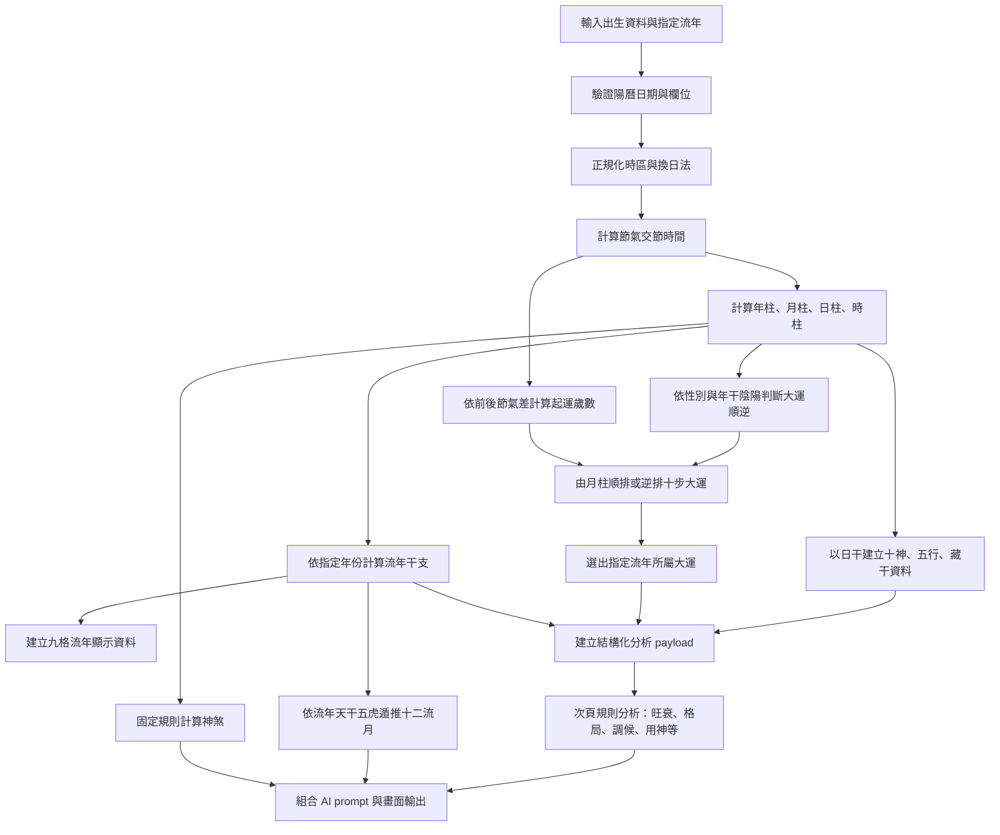

# 八字運算腳本化整合藍圖

## 目的

這份文件把目前 `apps/bazi/index.html` 與 `apps/bazi/bazi-analysis.html` 內的八字運算、前後節氣起運、十步大運、流年、流月、神煞、分析 payload 與畫面產出流程，整理成可拆成獨立腳本的規格。

未來腳本的核心原則：

1. 四柱、大運、流年、流月、十神、神煞必須由程式規則計算。
2. AI 只能接收已計算完成的結構化資料做文字解讀，不可自行猜排盤結果。
3. 運算核心不可依賴 DOM、畫面文字、CSS 或 localStorage。
4. 同一份核心結果應可供 Web、CLI、API、iOS、Android 與 AI prompt 共用。

## 現行來源與優先順序

目前可執行真相：

```text
apps/bazi/index.html
apps/bazi/bazi-analysis.html
```

輔助說明：

```text
apps/bazi/docs_algorithm.md
apps/bazi/docs_overview.md
apps/bazi/docs/regression_cases.md
apps/bazi/SMOKE_TEST.md
```

若文件與現行程式衝突，先以現行程式與回歸案例確認，再修正文檔或演算法。

## 完整資料流



## 一、輸入資料契約

建議腳本輸入：

```ts
interface BaziInput {
  year: number;
  month: number;
  day: number;
  hour: number;
  minute: number;
  gender: "男" | "女";
  timezoneOffset: number;
  birthHemisphere: "北半球" | "南半球";
  dayChangeMethod: "子初換日" | "子正換日";
  targetYear: number;
}
```

現行預設：

```text
時區：UTC+8
出生地：北半球
換日法：子初換日
```

注意：現行程式中，`子初換日` 會讓 23:00-23:59 的日柱切換到隔日；`子正換日` 則不提前換日。舊文件若寫「晚子時不換日」，不可直接當作現行預設。

## 二、驗證與正規化

### 驗證

腳本必須檢查：

- 年為 `1-9999` 的整數。
- 月為 `1-12`。
- 日必須是該年月的有效日期。
- 時為 `0-23`。
- 分為 `0-59`。
- `targetYear` 為正整數。

### 正規化

1. 將輸入時間依 `timezoneOffset` 轉為 UTC。
2. 再轉為引擎使用時區，目前為 UTC+8。
3. 若換日法為 `子初換日` 且正規化後小時為 23，日柱日期加一天。
4. 年柱、月柱仍以實際節氣交接時間判定。

現行函式對照：

```text
validateBirthInput()
normalizeBirthDate()
localTimeToUtcMs()
```

## 三、基礎常數

腳本應集中管理，不要散落在 UI：

- 十天干、十二地支、六十甲子循環。
- 天干五行、天干陰陽。
- 地支五行、地支藏干、地支主氣。
- 五行相生、五行相剋。
- 五虎遁、五鼠遁。
- 月支順序：寅卯辰巳午未申酉戌亥子丑。
- 十二個月令節氣與太陽黃經角度。
- 甲子年基準：`1984`。
- 日柱 JDN offset：現行為 `49`，正式商業定盤前仍需權威萬年曆校準。

## 四、節氣運算

現行程式不是用固定日期表，而是以太陽視黃經估算交節時間。

流程：

1. 以每個月令節氣的估計日期建立前後五天搜尋區間。
2. 計算太陽視黃經。
3. 找出目標黃經跨越區間。
4. 以二分搜尋逼近交節時間。
5. 以分鐘為單位取整。

月令節氣：

| 節氣 | 月支 | 黃經 |
|---|---:|---:|
| 立春 | 寅 | 315 |
| 驚蟄 | 卯 | 345 |
| 清明 | 辰 | 15 |
| 立夏 | 巳 | 45 |
| 芒種 | 午 | 75 |
| 小暑 | 未 | 105 |
| 立秋 | 申 | 135 |
| 白露 | 酉 | 165 |
| 寒露 | 戌 | 195 |
| 立冬 | 亥 | 225 |
| 大雪 | 子 | 255 |
| 小寒 | 丑 | 285 |

現行函式對照：

```text
getSolarApparentLongitude()
findSolarTermUtcMs()
getSolarMonthTermTimes()
```

## 五、四柱運算

### 年柱

1. 以立春作為年柱切換點，不以農曆初一切換。
2. 出生時間在當年立春後，使用當年干支。
3. 出生時間在當年立春前，使用前一年干支。

### 月柱

1. 以月令節氣切月，不以農曆月份切月。
2. 月支固定由寅月開始。
3. 月干依年干使用五虎遁推算。

### 日柱

1. 將正規化後的日柱日期換算為 JDN。
2. 使用 `(JDN + offset) mod 60` 取得日柱。
3. 現行 offset 為 `49`，仍需權威萬年曆校準。

### 時柱

1. 時支依兩小時一個地支推算。
2. 時干依日干使用五鼠遁推算。

現行函式對照：

```text
getYearPillar()
getMonthPillar()
getDayPillar()
getHourPillar()
calculateFourPillars()
```

## 六、十神、五行與藏干

所有十神都以日柱天干，也就是日主為核心。

判斷需要同時考慮：

- 日主與目標天干的五行生剋關係。
- 日主與目標天干的陰陽是否相同。

十神規則：

| 關係 | 同陰陽 | 異陰陽 |
|---|---|---|
| 同我 | 比肩 | 劫財 |
| 我生 | 食神 | 傷官 |
| 我剋 | 偏財 | 正財 |
| 剋我 | 七殺 | 正官 |
| 生我 | 偏印 | 正印 |

每個地支需輸出：

- 地支五行。
- 主氣天干與主氣十神。
- 藏干列表。
- 每個藏干的五行、十神、氣類型。

現行函式對照：

```text
getTenGod()
toPayloadPillar()
countTenGods()
countFiveElementsForPayload()
```

## 七、大運運算

### 順逆行

```text
陽男陰女：順行
陰男陽女：逆行
```

### 前後節氣起運

```text
順行：取出生後下一個月令節氣
逆行：取出生前上一個月令節氣
```

節氣差換算：

```text
三天一歲
startAge = diffHours / 24 / 3
```

### 十步大運

1. 以月柱為基準。
2. 順行向後推干支，逆行向前推干支。
3. 第一運不是月柱本身，而是月柱移動一柱後的干支。
4. 每步十年，共輸出十步。
5. 每步需計算天干十神與地支主氣十神。

建議輸出：

```ts
interface LuckCycle {
  index: number;
  pillar: string;
  stem: string;
  branch: string;
  startAge: number;
  endAge: number;
  startAgeExact: number;
  startYear: number;
  endYear: number;
  stemTenGod: string;
  branchTenGod: string;
}
```

現行限制：

- `startAgeExact` 有小數。
- `startYear`、`endYear` 目前以整數年顯示，未真正輸出起運月份與交運日期。
- 指定流年所屬大運目前用西元年份區間判定，尚未按交運月份精確切換。

現行函式對照：

```text
getLuckDirection()
getAdjacentSolarTermForLuck()
calculateLuckStartInfo()
calculateLuckCycles()
```

## 八、流年運算

流年干支直接由西元年份對應六十甲子：

```text
annualIndex = targetYear - 1984
```

每個流年需輸出：

- 西元年份。
- 流年干支。
- 流年天干十神。
- 流年地支主氣十神。

現行主頁會建立九格流年：

```text
指定流年前 3 年 + 指定流年 + 指定流年後 5 年
```

指定流年的 `annualLuck` 與對應大運 `currentLuck` 會一起放入分析 payload。

現行函式對照：

```text
getAnnualFlow()
getAnnualFlows()
```

## 九、流月運算

現行主頁 payload 的 `monthlyLuck` 初始為空陣列，次頁會依指定流年天干自行推算十二流月。

規則：

1. 流月地支固定由寅月開始。
2. 流月天干依流年天干使用五虎遁。
3. 流月以節氣為界，不以農曆初一為界。
4. 現行次頁顯示的是約略西曆區間，不是精確交節時間。
5. 每一流月需分析與原局、大運、流年的合沖害等互動。

現行函式對照：

```text
getAnnualMonths()
enrichAnnualMonthsWithTenGods()
findBranchInteractions()
analyzeAnnualMonths()
```

## 十、結構化 payload

主頁完成排盤後，應建立一份與 UI 無關的資料物件。現行 payload 主要結構：

```ts
interface BaziAnalysisPayload {
  meta: {
    version: string;
    source: string;
    generatedAt: string;
  };
  user: {
    gender: "male" | "female";
    birthSolar: string;
    birthLunar: string;
    birthPlace: string;
    timezone: string;
    dayChangeRule: string;
  };
  pillars: {
    year: PayloadPillar;
    month: PayloadPillar;
    day: PayloadPillar;
    hour: PayloadPillar;
  };
  dayMaster: {
    stem: string;
    element: string;
    yinYang: string;
  };
  fiveElements: Record<string, number>;
  tenGodCounts: Record<string, number>;
  luckCycles: LuckCycle[];
  luckStartInfo: {
    direction: string;
    startAge: number;
    diffHours: number;
    solarTermName: string;
    solarTermTime: string;
  };
  currentLuck: object | null;
  annualLuck: object | null;
  monthlyLuck: object[];
}
```

瀏覽器目前使用：

```js
localStorage.setItem("baziAnalysisPayload", JSON.stringify(payload));
```

腳本版應直接回傳 JSON，不應依賴 localStorage。

## 十一、次頁規則分析與產出

次頁收到 payload 後，依序產生：

1. 日主旺衰。
2. 五行氣勢。
3. 十神結構。
4. 干支作用。
5. 格局判定。
6. 調候分析。
7. 用神喜忌初判。
8. 性格、事業、財運、感情、健康等人生領域。
9. 大運分析。
10. 流年分析。
11. 十二流月分析。
12. 神煞輔助。
13. AI 綜合論命 prompt。

這些分析中：

- 四柱、大運、流年、流月、十神、神煞是固定規則資料。
- 旺衰、格局、調候、用神是目前基礎規則引擎的初判。
- AI 只能根據 payload 與初判結果寫文字，不可改寫排盤結果。
- 神煞只作輔助，不可凌駕旺衰、格局、用神與大運流年。
- 健康只能描述五行命理傾向，不可作醫療診斷。

## 十二、建議腳本模組

```text
bazi-script/
├── constants.ts
├── types.ts
├── validate.ts
├── time.ts
├── solar-terms.ts
├── ganzhi.ts
├── pillars.ts
├── ten-gods.ts
├── luck-cycles.ts
├── annual-flow.ts
├── monthly-flow.ts
├── shensha.ts
├── payload.ts
├── analysis.ts
├── prompt.ts
├── cli.ts
└── tests/
```

建議責任：

| 模組 | 責任 |
|---|---|
| `validate.ts` | 驗證輸入 |
| `time.ts` | 時區、換日、JDN |
| `solar-terms.ts` | 節氣交節時間 |
| `pillars.ts` | 四柱 |
| `ten-gods.ts` | 十神、藏干、五行 |
| `luck-cycles.ts` | 順逆、起運、十步大運 |
| `annual-flow.ts` | 指定流年與九格流年 |
| `monthly-flow.ts` | 十二流月 |
| `shensha.ts` | 固定神煞規則 |
| `payload.ts` | 組合共用 JSON |
| `analysis.ts` | 旺衰、格局、調候、用神初判 |
| `prompt.ts` | AI prompt |
| `cli.ts` | 命令列輸入輸出 |

## 十三、建議腳本主函式

```ts
export function calculateBazi(input: BaziInput): BaziAnalysisPayload {
  validateInput(input);

  const normalized = normalizeBirthDate(input);
  const pillars = calculateFourPillars(normalized);
  const dayMaster = pillars.day.stem;

  const luckDirection = getLuckDirection(input.gender, pillars.year.stem);
  const luckStartInfo = calculateLuckStartInfo(input, luckDirection);
  const luckCycles = calculateLuckCycles(
    pillars.month,
    dayMaster,
    input.year,
    luckDirection,
    luckStartInfo.startAge,
    10
  );

  const annualLuck = getAnnualFlow(input.targetYear, dayMaster);
  const annualFlows = getAnnualFlows(input.targetYear, dayMaster);
  const currentLuck = findLuckCycleForYear(luckCycles, input.targetYear);

  return buildPayload({
    input,
    pillars,
    dayMaster,
    luckDirection,
    luckStartInfo,
    luckCycles,
    currentLuck,
    annualLuck,
    annualFlows
  });
}
```

## 十四、建議 CLI 使用方式

```sh
node dist/cli.js \
  --birth "1974-10-03 04:00" \
  --gender female \
  --timezone Asia/Taipei \
  --day-change late-zi \
  --target-year 2026 \
  --format json
```

建議輸出格式：

```text
json       完整結構化資料
summary    四柱、大運、流年摘要
prompt     AI 綜合論命 prompt
markdown   可閱讀報告
```

## 十五、回歸驗收

### Case 1：四柱

```text
輸入：2024/03/10 00:20
期望：甲辰 丁卯 癸酉 壬子
```

### Case 2：大運與流年

```text
輸入：1974/10/03 04:00 女命，指定流年 2026
期望：currentLuck.pillar = 戊辰
```

### Case 3：流年切換

```text
指定流年改為 1998 或 2046
期望：annualLuck、currentLuck 與依賴它們的分析同步更新
```

### Case 4：資料一致性

```text
畫面顯示、JSON、AI prompt 使用同一份 payload
不可由 DOM 文字反抓資料
```

## 十六、正式腳本前必須決定的項目

1. 日柱 offset 是否已用權威萬年曆校準。
2. 節氣交節時間是否繼續使用現行太陽視黃經算法，或改接權威曆法服務。
3. 大運交運日是否要精確到年月日，而不是只用整數年份。
4. 指定流年所屬大運是否要按交運日精確切換。
5. 南半球是否需要實作季節與月令校正。
6. 真太陽時、出生地經度、早晚子時是否要納入。
7. 流月是否要輸出精確交節時間。
8. `bazi-analysis.html` 的基礎旺衰、格局、調候、用神初判是否要升級為正式規則引擎。

## 十七、現行與歷史功能區分

現行 `apps/bazi/index.html` 主要產出：

- 四柱。
- 十步大運。
- 九格流年。
- `baziAnalysisPayload`。
- 論命次頁入口。

部分舊文件仍提到：

- 六柱十二字整合分析。
- 下載 AI 分析 Markdown。
- 手動起運。

這些內容屬歷史或舊版功能描述。製作新腳本時，應先決定是否要重新納入，不可假設現行主頁仍完整提供。
