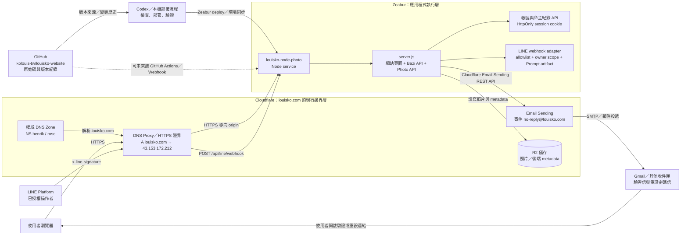
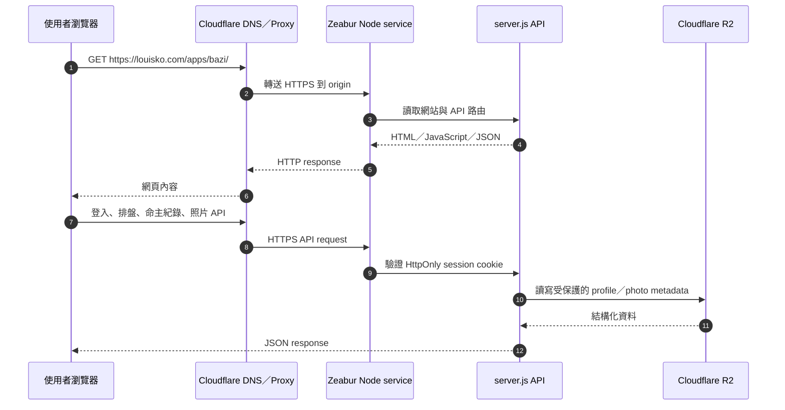
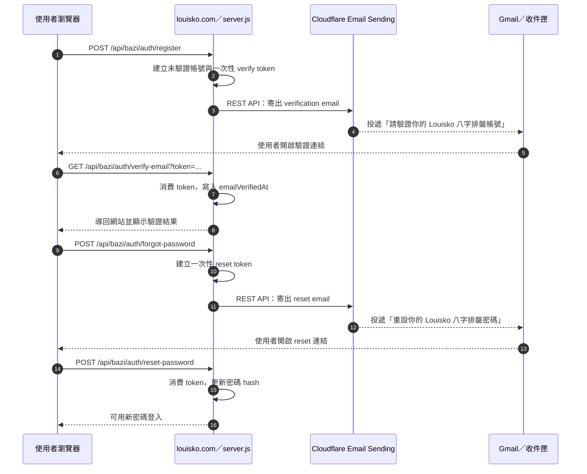
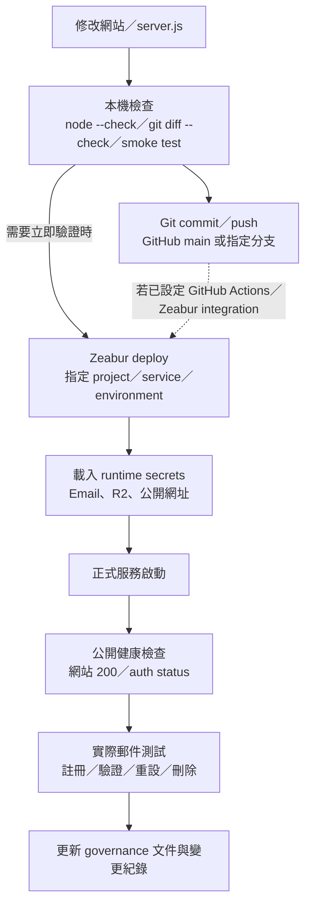
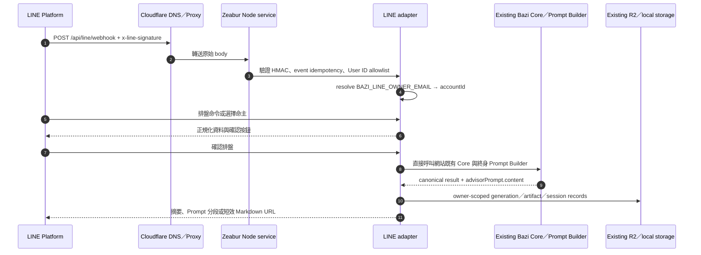
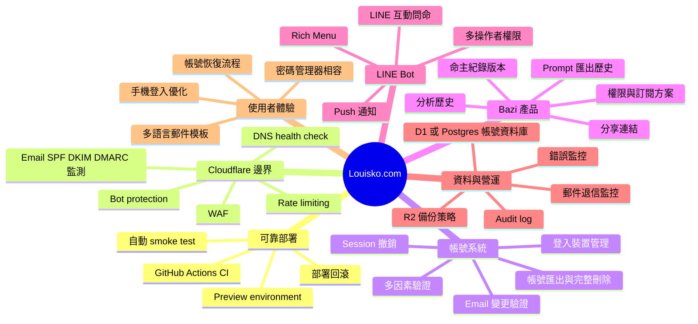

# Louisko.com 後端關係與擴充架構

## 文件定位

本文件描述目前 `louisko.com` 的 GitHub、Zeabur、Cloudflare、Gmail 與網站之間的實際關係，並列出未來可安全擴充的功能方向。

核心原則：這些服務不是同一層。GitHub 管原始碼與版本，Zeabur 跑應用程式，Cloudflare 管 DNS／網站邊界／寄信，Gmail 收信；使用者可透過網站或已授權的 LINE Bot 操作同一批 Bazi owner 資料。

## 一、目前總體架構

### 元件責任

| 元件 | 目前責任 | 不應誤解成 |
|---|---|---|
| GitHub | 保存 `louisko-website` 原始碼、commit、分支與版本歷史 | 不直接寄驗證信，也不是正式網站主機 |
| Zeabur | 執行 `louisko-node-photo` Node service、接收部署與環境變數 | 目前不是權威 DNS；網域雖由 Zeabur 購買／續期入口管理，DNS 已交由 Cloudflare |
| Cloudflare DNS | `louisko.com` 的權威 nameserver、A record、HTTPS／proxy 邊界 | 不是 GitHub 原始碼倉庫，也不是使用者帳號資料庫 |
| Cloudflare Email Sending | 讓 `server.js` 透過 REST API 發送驗證與重設密碼郵件 | Gmail 的收件箱或帳號資料庫 |
| Gmail | 實際接收測試及使用者的驗證／重設信件 | 不是網站登入服務的儲存層 |
| LINE Platform | 傳送 webhook 與接收摘要、Prompt 分段、Markdown 短效連結 | 不是網站帳號資料庫；操作者必須通過 User ID allowlist |
| LINE webhook adapter | 驗證簽章、解析指令、解析 owner、呼叫同一 Bazi Core／Prompt Builder | 不是第二套八字演算法，也不使用網站密碼 |
| louisko.com 網站 | 提供 Bazi／Photo UI，並由同一 Node service 提供 API | 不是獨立於後端的另一套主機 |

## 二、正式網站請求流程

目前正式目標：

- 網站入口：[https://louisko.com/apps/bazi/](https://louisko.com/apps/bazi/)
- Node service：`louisko-node-photo`
- Bazi 帳號 API：`/api/bazi/auth/*`
- 命主紀錄 API：`/api/bazi/profiles`
- Photo API：`/api/photo-cloud/*`
- LINE webhook：`/api/line/webhook`
- 正式狀態：`GET /api/bazi/auth/status` 應回報 `emailConfigured: true`

## 三、Email 驗證與忘記密碼流程

安全邊界：

1. 驗證 token 與 reset token 只存在於後端流程，不能寫入前端 localStorage、GitHub、文件或 log。
2. 登入依賴 Email 已驗證與密碼 hash；session 使用 HttpOnly cookie。
3. Gmail 只負責收件與讓使用者點擊連結，不能取代後端的帳號狀態。
4. Cloudflare API token 只放在 Zeabur runtime secret；目前使用 `LOUISKO_CLOUDFLARE_EMAIL_TOKEN`，實際值不記錄。

## 四、部署與變更流

目前要特別區分兩種關係：

- GitHub 是版本來源與歷史紀錄；不可假設每個 GitHub push 都自動部署，除非已確認 webhook／Actions／Zeabur integration。
- Zeabur CLI 或控制台部署是目前可直接控制正式 service 的部署路徑；部署完成後仍需用 `louisko.com` 實際驗證，而不是只看 Zeabur 的成功訊息。

## 五、LINE 私有 Bazi 流程

LINE 與網站的分界是操作者身分，不是另一份命主資料：`BAZI_LINE_ALLOWED_USER_IDS` 決定誰能操作，`BAZI_LINE_OWNER_EMAIL` 決定操作哪個網站帳號，Bazi Core 決定如何排盤。`查看 Prompt` 只讀最新 artifact；`重新產生` 才更新 generation／artifact。

## 六、目前已具備的功能

| 領域 | 已具備功能 |
|---|---|
| 網站 | Bazi 排盤、命主紀錄、Photo 頁面與同一 Node service API |
| 帳號 | Email 註冊、登入、登出、跨裝置命主紀錄同步 |
| Email 安全 | Email 驗證、重新寄送驗證信、忘記密碼、一次性重設密碼、刪除帳號 |
| 儲存 | Cloudflare R2 照片與後端 metadata／profile 儲存路徑 |
| 部署 | GitHub 版本管理、Zeabur Node service、Cloudflare DNS／proxy |
| 網域 | `louisko.com` 使用 Cloudflare `henrik`／`rose` nameservers；Zeabur 保留購買／續期入口 |
| 郵件 | Cloudflare Email Sending 已啟用，正式驗證信與重設信已完成端到端測試 |
| LINE Bot | Phase 1 私有排盤確認、命主列表、Prompt 查看、Markdown 短效下載、簽章驗證、allowlist、TTL session、rate limit 與 webhook idempotency |

## 七、未來可擴充功能

### 建議優先順序

| 優先級 | 功能 | 主要新增關係 | 直接價值 |
|---|---|---|---|
| P0 | GitHub Actions CI + smoke test | GitHub → Actions → Zeabur | 每次變更先驗證，降低正式部署風險 |
| P0 | 登入／註冊 rate limit | Cloudflare → Node API | 降低暴力嘗試與郵件濫發 |
| P0 | 郵件退信與寄送監測 | Cloudflare Email → monitoring | 及早發現驗證信未抵達 |
| P1 | Email 變更驗證與裝置管理 | Node auth → R2／資料庫 | 增加帳號控制與安全性 |
| P1 | 正式資料庫層 | Node → D1 或 Postgres | 讓帳號、session、profile 查詢更可治理與備份 |
| P1 | Preview environment | GitHub branch → Zeabur preview | 在不影響 `louisko.com` 下驗證新功能 |
| P2 | WAF、Bot protection、Analytics | Cloudflare → website／API | 降低惡意流量並了解使用狀況 |
| P2 | Bazi 分析歷史、Prompt 歷史與分享 | Website → auth/profile storage | 將排盤結果轉為可回訪的長期產品 |

## 八、未來邊界設計建議

- 不要讓 Gmail 成為登入資料庫；帳號狀態、密碼 hash、session 與命主紀錄仍由後端控制。
- 不要讓 Cloudflare DNS 與 Zeabur service 設定分散成沒有紀錄的手動操作；每次變更同步寫入治理文件。
- 不要把 GitHub Actions secret、Zeabur token、Cloudflare token 或 R2 access key 放在 repository。
- 未來若導入 D1／Postgres，先定義資料遷移、帳號刪除、備份與復原策略，再切換 storage provider。
- 所有新增的認證功能都必須通過：跨裝置登入、驗證信、重設密碼、錯誤密碼、session 撤銷、帳號刪除與重複請求測試。

## 相關文件

- [部署與網域治理](./deployment-reference.md)
- [Cloudflare／R2 操作](./cloudflare-r2-operations.md)
- [Bazi 應用索引](../../apps/bazi/INDEX.md)
- [正式變更紀錄](../../scripts/site-workflow/WEB_CHANGE_LOG.md)
